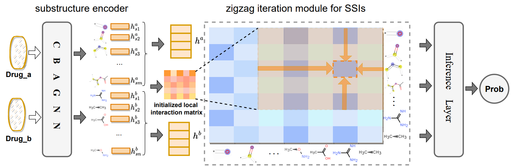

## A Chemical Bonds Assisted Zigzag Iteration Network for Drug Drug Interaction Prediction
#### Paper summary
##### Task
The DDI prediction task aims to develop a model  that accepts two
drugs (𝑑𝑥 and 𝑑𝑦) and their interaction (𝑟) as inputs and outputs a
scalar indicating the probability whether drug co-administration of
𝑑𝑥 and 𝑑𝑦 could lead to interaction 𝑟 .

##### Model

[//]: # (![]&#40;./figure/model.png &#41; )

An overview of proposed Chemical Bonds Assisted Zigzag Iteration Network(CBA-ZI). It has three main components: a substructure encoder, a zigzag iteration module for SSI s, and
an inference layer. The substructure encoder embeds every atom in a drug molecule and then selects 𝑘 atomic characteristics as
key substructures. The zigzag iteration module for SSIs computes interactions between substructures and uses known SSIs to
update unknown SSIs. Finally, the updated SSIs of two drugs are fed into the inference layer to predict DDIs

##### Contribution
   * We propose chemical bonds assisted zigzag iteration network ( CBA-ZI )
to consider the correlations between SSI s so as to improve the
modeling capabilities for SSIs. Through a zigzag iteration mod-
ule (ZI), it can capture SSIs which are difficult to learn directly.
   * We introduce bond types for chemical graphs of drugs and devise
a CBAGNN to better encode each substructure as a representation
vector.
   * We carry out extensive experiments on a benchmark dataset (i.e.,
Drugbank) to verify and analyze the effectiveness of CBA-ZI . The
results show that CBA-ZI outperforms all baselines by a large
margin on most evaluation metrics

#### Experiment details
 new-old dataset     |ACC     | AUC           |AP     |F1
-------- | -----|---------------| -----| -----
data1  | 77.97| 85.27         | 85.68| 78.17
data2  | 78.07| 84.23         | 85.15| 77.95
data3  | 79.55| 86.07         | 86.86| 79.96
mean ± std  | 78.53 ± 0.72| 85.19  ± 0.75 | 85.89  ± 0.71| 78.69 ± 0.90

new-new dataset      |ACC     |AUC     |AP     |F1
-------- | -----| -----| -----| -----
data1  | 68.97| 77.09| 77.92| 71.71
data2  | 69.20| 74.54| 75.95| 69.51
data3  | 71.44| 77.79| 79.39| 72.11
mean ± std  | 69.87 ± 1.11| 76.47 ± 1.39| 77.75 ± 1.40| 71.11 ± 1.14

##### Running
Requirements
> Python == 3.6
PyTorch == 1.7.1+cu110
PyTorch Geometry ==  2.0.3
rdkit == 2020.09.1 (for data preprocessing)

##### Training:

Train data1 in command line

`python main_real_fake.py --train_filename='data/drugbank_cold_start/1/ddi_train_cleaned.csv' --test_filename1='data/drugbank_cold_start/1/ddi_bothnew_cleaned.csv' --test_filename2='data/drugbank_cold_start/1/ddi_eithernew_cleaned.csv' --sample_file='data/drugbank_cold_start/1/ssi_old_new_1.json' --test False --ratio_k=26 --dropout=0.2`  

Train data2 in command line

`python main_real_fake.py --train_filename='data/drugbank_cold_start/2/ddi_train_cleaned.csv' --test_filename1='data/drugbank_cold_start/2/ddi_bothnew_cleaned.csv' --test_filename2='data/drugbank_cold_start/2/ddi_eithernew_cleaned.csv' --sample_file='data/drugbank_cold_start/2/ssi_old_new_2.json' --test False --ratio_k=26 --dropout=0.2`  

Train data3 in command line

`python main_real_fake.py --train_filename='data/drugbank_cold_start/3/ddi_train_cleaned.csv' --test_filename1='data/drugbank_cold_start/3/ddi_bothnew_cleaned.csv' --test_filename2='data/drugbank_cold_start/3/ddi_eithernew_cleaned.csv' --sample_file='data/drugbank_cold_start/3/ssi_old_new_3.json' --test False --ratio_k=26 --dropout=0.2`  

##### Test 
Test in command line

`python main_real_fake.py --test True --block_path='your checkpoint path'`  

for example:

`python main_real_fake.py --test True --block_path='checkpoint/3/no_acc0.7925roc0.8563prc0.8612result'` 

